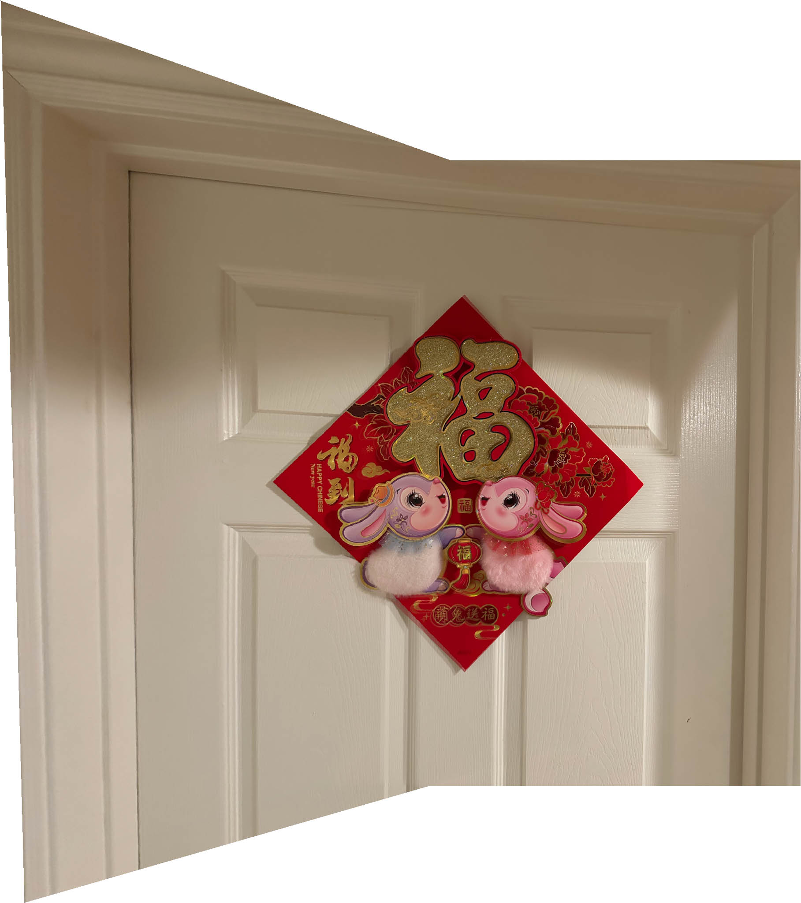

## UC Berkeley COMPSCI 180 Projects

This repository contains my projects for UC Berkeley's [COMPSCI 180 - Intro to Computer Vision and Computational Photography](https://inst.eecs.berkeley.edu/~cs180/fa24/) (Fall 2024) by [Alexei Efros](https://people.eecs.berkeley.edu/~efros/). They are also showcased on [this webpage](https://jianglanwei.github.io/cs180/). 

<table style="width:100%;border:0px;border-spacing:0px 10px;border-collapse:separate;margin-right:auto;margin-left:auto;"><tbody>
   <tr>
      <td style="padding:16px;width:20%;vertical-align:middle">
      
      </td>
      <td style="padding:8px;width:80%;vertical-align:middle">
         <b>Final Project
         : Neural Radiance Field (NeRF)  </b>
         <a href="https://github.com/jianglanwei/cs180/tree/main/proj6/OfficialSpec">Official Spec</a>
         \
         <a href="https://jianglanwei.github.io/cs180/proj6/">My Webpage</a>
         \
         <a href="https://github.com/jianglanwei/cs180/tree/main/proj6/code">My Code</a>  
         My final project consists two parts: <b>Fit a Neural Field to a 2D Image</b>
         (Part A), and <b>Fit a Neural Radiance Field from Multi-view Images</b> 
         (Part B).  
         In Part A, I built a <b>Multiplayer Perceptron (MLP) network</b> to 
         fit a single 2D image so that given any pixel's coordinate, the network 
         can predict the pixel's RGB color. When the image's shape is provided, 
         the network can <b>reconstruct the whole image</b>.  
         In Part B, I trained a larger MLP network to serve as a <b>Neural 
         Radiance Field (NeRF)</b> and used it to fit a 3D <i>Lego</i> object through 
         inverse rendering from <b>multi-view calibrated images</b>. The pixels 
         on the images were bounded with rays represented in 3D world coordinate 
         system. Sample locations were gathered along the rays, and their volume 
         rendering results were used to fit the RGB colors on the images' pixels. 
         In this way the <i>Lego</i> object was modeled into the NeRF. Using the 
         trained NeRF, I'm able to predict the images of the <i>Lego</i> taken 
         from <b>any given perspectives</b>. I rendered these images into a video 
         to create a rotating effect of the <i>Lego</i>.
          &emsp;
      </td>
   </tr>

   <tr>
      <td style="padding:16px;width:20%;vertical-align:middle">
      
      </td>
      <td style="padding:8px;width:80%;vertical-align:middle">
         <b>Project 5: Fun with Diffusion Models  </b>
         Official Spec (
            <a href="https://github.com/jianglanwei/cs180/tree/main/proj5/OfficialSpec-A">Part A</a>
            \
            <a href="https://github.com/jianglanwei/cs180/tree/main/proj5/OfficialSpec-B">Part B</a>
         )
         \
         <a href="https://jianglanwei.github.io/cs180/proj5/">My Webpage</a>
         \
         <a href="https://github.com/jianglanwei/cs180/tree/main/proj5/code">My Code</a>     
         Project 5 consists two parts: <b>The power of Diffusion Models</b> 
         (Part A) and <b>Diffusion Models from Scratch</b> (Part B).      
         In Part A, I mainly played around with a pretrained diffusion model
         called <b>DeepFloyd IF</b>. First, I used the model to conduct
         <b>denoising</b>. I blurred a sample image using random noise, 
         and used the model to predict that noise. I also denoised the image using
         <b>Gaussian Blur</b> and compared the denoised results. Then, I denoised 
         a random noise image to obtain a computer-generated image. I adapted the
         <b>Classifier-Free Guidance</b> technic. Later, I conducted image-to-image 
         translation, where images are translated into similar images either based 
         on masks or text prompts. At last, I produced <b>Visual Anagrams</b>, 
         <b>Hybrid Images</b>, and a course logo.     
         In Part B, I built and trained a diffusion model from scratch. First, 
         I trained a UNet to denoise half-noisy <b>MNIST</b> images (original 
         image + 50% pure noise). Then, to denoise images with different
         amount of noise, I added <b>Time Conditioning</b> to the UNet, where the 
         UNet is told how noisy each images are. The trained UNet can accurately 
         predict the noise that had been added to the images. Using the 
         trained UNet denoiser, I generated MNIST-like images by denoising 
         pure noise in 300 steps, only to find the computer 
         generated images looks little like human-written numbers. To boost the 
         result, I added <b>Class Conditioning</b> to the UNet, where the UNet 
         is not only told how noisy the images are, but also the labels (0 to 9) 
         of the images. 10% of the images are not provided with a label. I adapted 
         <b>Classifier-Free Guidance</b> to generate MNIST-like images. The results
         are much better compared the previous attempt.  
      </td>
   </tr>

   <tr>
      <td style="padding:16px;width:20%;vertical-align:middle">
      
      </td>
      <td style="padding:8px;width:80%;vertical-align:middle">
         <b>Project 4: Autostitching and Photo Mosaic  </b>
         Official Spec (
            <a href="https://github.com/jianglanwei/cs180/tree/main/proj4/OfficialSpec-A">Part A</a>
            \
            <a href="https://github.com/jianglanwei/cs180/tree/main/proj4/OfficialSpec-B">Part B</a>
         )
         \
         <a href="https://jianglanwei.github.io/cs180/proj4/">My Webpage</a>
         \
         <a href="https://github.com/jianglanwei/cs180/tree/main/proj4/code">My Code</a>  
         Project 4 consists two parts: <b>Image Warping and Mosaicing</b> 
         (Part A) and <b>Feature Matching for Autostitching</b> (Part B).  
         In Part A, I rectified images using <b>Perspective Transform</b>. 
         I manually selected correspondences on the images, and warped them
         so that their transformed correspondences form a rectangle.
         I also produced <b>mosaics images</b> by blending pairs of images that 
         overlap with each other. First, I manually matched a few pixels that 
         represent the same corner of an object on the two images. Then, I 
         treated these pixel matches as correspondences, and warped the first 
         image so that after warping, the correspondences on the first image 
         aligns with the correspondences on the second images. In this way, 
         the same objects on the two images would match. Finally, I conducted 
         <b>Alpha Blend</b> on the output mosaic to erase the edge between the 
         two images.  
         ;In Part B, I also produced mosaic images, 
         only this time instead of manually matching the pixels, the pixel 
         matches are automatically detected and selected.
         Corners serve as great symbols of objects on an image, so I used 
         <b>Harris Corner Detector</b> to find the corners on the images, and 
         treat them as interest points. Then, I used 
         <b>Adaptive Non-Maximal Suppression (ANMS)</b> to select a few interest 
         points that are not only high in "corner strength", but also as 
         uniformly distributed in the image as possible. They are the potential 
         correspondences. Later, I matched the potential correspondences using 
         <b>Feature Descriptors</b>. If the best match of a 
         potential correspondence did not score significantly higher than its 
         second-best match, I would abandon this pixel. The matched pixels
         still may contain error. I found the optimal set of matches using the 
         idea of <b>Random Sample Consensus (RANSAC)</b>. At last, 
         similar to Part A, I used the optimal matches to conduct perspective 
         transform on the first image so that it aligns with the second image, 
         and blended the overlapping region to erase the edge.
          &emsp; 
      </td>
   </tr>

   <tr>
      <td style="padding:16px;width:20%;vertical-align:middle">
      
      </td>
      <td style="padding:8px;width:80%;vertical-align:middle">
         <b>Project 3: Face Morphing and Modelling a Photo Collection  </b>
         <a href="https://github.com/jianglanwei/cs180/tree/main/proj3/OfficialSpec">Official Spec</a>
         \
         <a href="https://jianglanwei.github.io/cs180/proj3/">My Webpage</a>
         \
         <a href="https://github.com/jianglanwei/cs180/tree/main/proj3/code">My Code</a>  
         In the first part of this project, I morphed two face images using 
         <b>Affine Transformation</b>. I obtained 100 correspondences for 
         each of the two faces and computed their average coordinates.
         <b>Triangulation</b> was conducted on the correspondences and for 
         each triangle, <b>Affine Matrixes</b> were generated to stretch the 
         triangles from the original image to the Midway image. I used <b>Cross 
               Dissolve</b> to bind the color. I furtherly generated a sequence 
         of 51 morphed images using different <b>Morph Weight</b> to produce the 
         morphing GIF. In the second part, I computed the mean face of 12 
         Brazilian faces, and stretched my face into the shape of the mean face.
         I also computed the mean face of 12 smiling Brazilian faces to add a smile 
         on my grim portrait.
          &emsp; 
      </td>
   </tr>

   <tr>
      <td style="padding:16px;width:20%;vertical-align:middle">
      
      </td>
      <td style="padding:8px;width:80%;vertical-align:middle">
         <b>Project 2: Fun with Filters and Frequencies  </b>
         <a href="https://github.com/jianglanwei/cs180/tree/main/proj2/OfficialSpec">Official Spec</a>
         \
         <a href="https://jianglanwei.github.io/cs180/proj2/">My Webpage</a>
         \
         <a href="https://github.com/jianglanwei/cs180/tree/main/proj2/code">My Code</a>  
         By applying filters and analyzing frequencies, images can be processed 
         and combined in interesting ways.
         In the first part of this project, edge detection is conducted by applying 
         the <b>Finite Difference Filter</b>. <b>Gaussian Filter</b> is applied to 
         get rid of the unnecessary wrinkles. Then, images are sharpened by stacking 
         its edges onto itself. The second part of this project consists of two 
         image binding tasks. The first task generates Hybrid Image by adding the 
         high frequency of one image to the low frequency of another. Both successful 
         and failing attempts are introduced. The second task blends images by 
         applying the <b>Gaussian Stack</b> and the <b>Laplacian Stack</b>.
          &emsp;
      </td>
   </tr>

   <tr>
      <td style="padding:16px;width:20%;vertical-align:middle">
      
      </td>
      <td style="padding:8px;width:80%;vertical-align:middle">
         <b>Project 1: Colorizing the <i>Prokudin-Gorskii</i> Photo Collection  </b>
         <a href="https://github.com/jianglanwei/cs180/tree/main/proj1/OfficialSpec">Official Spec</a>
         \
         <a href="https://jianglanwei.github.io/cs180/proj1/">My Webpage</a>
         \
         <a href="https://github.com/jianglanwei/cs180/tree/main/proj1/code">My Code</a>  
         <i>Prokudin-Gorskii</i> photographed the Russian Empire using black-and-white 
         negatives with red, green and blue filters, hoping future technologies could 
         stack the three layers to produce colored image. I took the digitized negatives 
         of <i>Prokudin-Gorskii</i>'s work to produce the RGB color image. The original 
         three color layers from <i>Prokudin-Gorskii</i>'s work were not accurately aligned, 
         so I designed an alignment algorithm using <b>Image Pyramid</b> and <b>Edge 
         Detection</b> to preprocess the layers before stacking them together.
          &emsp;
      </td>
   </tr>
</table>

> **Disclaimer:**  All materials, including assignments, documents, and source code, are provided solely for personal coursework. All rights reserved by the UC Berkeley CS180 course staff. Redistribution or commercial use is strictly prohibited.

Final Project finished on Dec 9, 2024.
